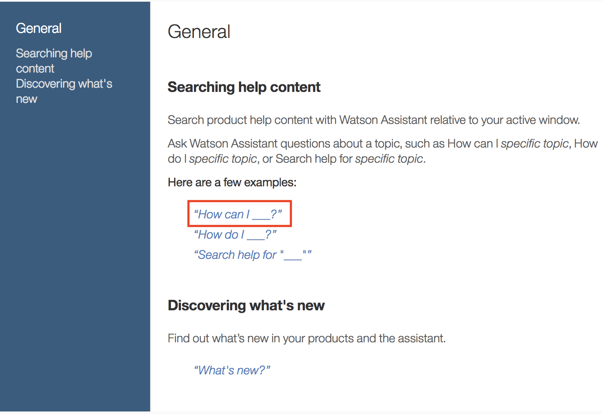

# General tab

## Description

The description is a useful place to describe your agent skill as well as the sorts of questions that it supports. It is designed to serve as an initial reference when sharing and collaborating with others.

By clicking the edit button, you will be able to enter custom markdown(MD) in a code editor. For more details on what type of MD is support, check out the section [Online Help](#online-help) below. Once you apply these changes, you will immediately see these changes reflected. 

The preview of the description is displayed at the [lab view](https://eba.ibm.com/assistant#/lab). In addition, the complete description is shown once you click on an agent to see the details and to access further actions:
 - view (or edit) in lab
 - delete the agent
 
Typical information to be present in the description:

**Overview**
 - Brief description of the skill(s) and working scenarios.
 - Type of questions the agent can answer

**Dependencies**
 - List dependencies which are required by the agent (e.g. [concepts](./../components/Ontology.md) provided by other agents)
 
**Support Information**
 - concept prefix -- see [Ontology](./../components/Ontology.md) for details.
 - Owner of the agent (Name and Contact options)

## Settings

Settings is a useful place to specify agent specific key-value parameters. These parameters will be accessible to the agent later in the action development pipeline via function input parameters.

```
const settingValue = params.settings[<key>]
```
Settings are part of the agent YAML file and can be exported.

## Secrets
Secrets should be used to store hidden parameter values. It may be used to store credential information, such as API keys. Secrets are part of the function input parameters.

```
const secretValue = params.secrets[<key>]
```
Only the secrets `key` is part of the YAML file and will be exported. The values must be added each time the agent is imported.

## Endpoints

EBA provides developers with control over various stages of its execution pipeline. Endpoints represent different processes that developers can utilize to achieve different behaviors suitable to their particular application. We support the following endpoints:

- [@start](#start-endpoint): session initialization process which can be useful for initializing certain resources.
- [@annotate](#annotate-endpoint): annotation process by which concepts are introduced into the syntax tree.
- [@force](#force-endpoint): lazy data execution process which converts lazy meta information into real data
- [@react](#react-endpoint): event handling process for evaluating and dispatching incoming events
- [@render](#render-endpoint): rendering process used for formatted responses to external channels (Slack and Watson Workspace)
- [@api](#api-endpoint): api registration process for enabling backend operations to be executed within frontend assets

### Start endpoint 

The start endpoint is run at the start of your session. Depending on your particular application, you may need to perform some initial setup to external systems or resources, e.g. obtain access token to be used in subsequent api calls. Another common use case for the start endpoint is to persist data locally throughout the session. For this purpose you can use our `store` api. The main factor to be considered when using the start endpoint is the availability of the data your are initializing. The endpoint is only run once, and, consequently, it should not be used for tasks that require routine updates, e.g. maintaining a list of named entities from external database that is updated in real time.

Below is an example that illustrates how to store a token on the start of a given session.

Example:

```
const client = require('./client.js');
const eba = require('eba');

module.exports.main = async (params) => {
    const token = await client.getToken();

    // persist token for subsequent calls
    return new eba.Result().store('token', token);
};
```


### Annotate endpoint

This annotate endpoint is used to introduce concepts into the parse tree. The concepts introduced into the tree during this process will serve as a kind of starting point for reasoning. It is important to note that, for a given user question, this endpoint is run in an iterative process until the state of the annotation tree is stable. For instance, introducing a set of concepts into the tree on iteration 1, will cause iteration 2 to run. Once there are no new changes, the annotation process will terminate. This means that buggy code, i.e. code that constantly updates the tree, can lead to an infinite process. Please check your Debug logs to identify such cases. Within this endpoint, you have access to the entire parse tree--`params.input.tokens`. You will note that a token within this tree is the composition of two data elements `annotations` and `token`. Annotations refer to the concept annotations for a given token. A single annotation will store the name of the concept as well as the confidence score for that annotation. Token refers to the actual NLToken, which contains data such as part of speech tagging, lemmatization, and synonyms list. Within our [eba helpers](../NodeHelpers.md), we have provided a set of useful functions for transforming this parse tree as well as introducing new concept annotations into it. 

Note that annotation is particularly useful for cases where named entity detection is required. Rather than asking: show me products for "IBM", where the company is denoted by quoted strings, we should simply ask: show me products for IBM. With named entity recognition, IBM can be annotated as a `:Company` concept.

Below is an example that simulates how a named entity recognition algorithm might be applied within our annotation process.

Example:

```
const eba = require('eba');
const api = require('./client-api.js');
const _ = require('lodash');

module.exports.main = async (params) => {
    // constructs original sentence as flat list of tokens
    const tokens = _(eba.flattenTree(params.input.tokens)).map('token').sortBy('id').value();

    // get known entites from storage
    const knownNames = await api.getKnownNames();

    // pattern matching for named entities across tokens
    const matches = getMatches(tokens, knownNames);

    // insert matching annotations into existing tree
    const namedEntityTree = eba.mapTree(params.input.tokens, (tt) => {
        const match = _.find(matches, ({name, tokens}) => _.some(tokens, ({id}) => id == tt.token.id));
        return (match) ? eba.insertAnnotation(tt, match.name) : tt;
    });

    return new eba.Result(namedEntityTree);
};
```


### Force endpoint

The force endpoint is used to force the execution of lazy data. Lazy data is simply a mechanism for delaying the retrieval of large data collections in order to reduce our application's data footprint and, in some cases, to even eliminate in-memory operations that modify these collections. As actions within EBA are highly composable, it is particularly useful to limit data passed from one action to another. Rather than supplying raw data to these interconnected actions, we instead can provide the system with a set of _instructions_ for producing the desired data as a kind of meta-data in place of real data. This enables us to layer multiple operations on top of each other before any data is actually produced, e.g. filtering, sorting, reversing, etc. In cases where the client api supports it, we can even push a data modifier operation, such as filtering, directly to the api-level. For more details on how to use lazy data within EBA, please consult our [node helpers interface](../NodeHelpers.md#lazy-evaluation) designed to handle this.

To illustrate the notion of lazy data as a meta data wrapper passed between your actions, consider a question where we want to fetch a large collection of data and perform some modifying operation on it as well, e.g. "show me all sessions in last week for chrome". Conceptually, we are simply fetching all sessions for a given timeframe as one action and then filtering those sessions where broswer is equal to Chrome in another action.

Action 1: `a subClassOf :Timeframe => :Sessions (optional :Relation (data a)) -> data :Sessions`:
```
const {Result, Params} = require('eba');

module.exports.main = async (params) => {
  const p = new Params(params);
  const timeframe = await p.get('a');
  const lazySessions = p.makeLazyData({method: 'getSessions', timeframe: timeframe});
  return new Result().setData(':Sessions', lazySessions);
};
```

In this first action we have created a lazy data wrapper for sessions data passing in as arguments both a method name as well as a timeframe: `p.makeLazyData({method: 'getSessions', timeframe: timeframe})`. We will see later that the method `getSessions` will be executed within our `@force` endpoint to produce _real_ data when we finally need it. We will supply the timeframe as a body of api request to produce these sessions, so we have also passed it as an argument as well. When this action finishes executing, it will return the following lazy data or meta data wrapper:

```
kind: genericLazyData
method: local
source:
    method: getSessions
    timeframe:
    end: '2018-09-17T07:00:00Z'
    start: '2018-09-10T07:00:00Z'
    value:
        grain: week
        type: value
        value: '2018-09-10T00:00:00.000-07:00'
        values:
        -
            grain: week
            type: value
            value: '2018-09-10T00:00:00.000-07:00'
```

This wrapper object provides directives to our system on how to treat this data. We tell the system that the `kind` of data is genericLazyData, meaning that it is lazy data which will be produced via a sub class extension of `GenericLazyExecutor` (see example below). It specifies `method`, which is a directive that we will load this data as an initial data source within our lazy data executor. As well as the `source`, which is source information provided when we created this lazy data wrapper. It will contain the parameters required to executed to supplied method, assuming you provided them within your action. These particular details are not important for you to remember as a developer. What is important to remember is that rather than producing real data, we are producing instructions to the system on how to produce this data when we later need it.

Action 2: `:Browser (optional :Relation (data :Sessions)) -> data :Sessions`
```
const {Result, Params} = require('eba');
const _ = require('lodash');

module.exports.main = async (params) => {
    // unwraps action input params for existing sessions and browser name
    const p = new Params(params);
    const sessions = p.getLazy(':Sessions');
    const browserName = _(p.get(':Browser')).map('form').join(' ');

    // returns filtered sessions data with nlg meta
    return new Result().setData(':Sessions', sessions.lazyFilter('browser', 'like', browserName));
};
```

In this action, we have accessed the lazy data wrapper described above just via `p.getLazy`. Afterwards we have provided an additional instruction to this wrapper, viz. a `lazyFilter` instruction. We often describe a lazy data wrapper as an onion for this reason. At the core of the onion we have instructions to produce a particular data set, e.g. sessions, but, on top of this core, we can layer multiple additional operations such as filtering, sorting, reversing, etc. The result of this action is defined in terms of the first action (see `source` field below). We simply applied a filter operation on top of this existing lazy data. The filter consists of the arguments we supplied above, viz. 'browser', 'like', and browserName. This means that Watson will filter all sessions where the browser field is similar (fuzzy match) to the browserName supplied in the original question, viz. 'chrome'.

```
args:
    - browser
    - like
    - chrome
kind: genericLazyData
method: filter
source:
    <lazy-data-object-from-the-fist-action>
```

Within the force endpoint, we typically extend a native class, `GenericLazyDataExecutor`, and, employing the template method design pattern, we override the `load` function within this class, which produces or loads our initial data set. Based on the input arguments within these function, we can dispatch to the appropriate sub class method to produce the real data required. Within the main function, we instantiate this subclass, and pass the functions input params to the `force` instance method and finally return the result. The force method will load the appropriate collection and any registered lazy operations will be applied on top of this by our system.

Below is an example that illustrates how to force lazy data for sessions within the endpoint.

Example:
```
const {Result, GenericLazyExecutor} = require('eba');
const {client} = require('./client.js');

class MyExecutor extends GenericLazyExecutor {

  constructor({storage, secrets}) {
    super({storage, secrets});
    this.storage = storage;
    this.secrets = secrets;
  }

  load(params) {
    const methods = { 'getSessions': this.getSessions };
    return (methods[params.method]) ? methods[params.method].call(this, params) : null;
  }

  getSessions({timeframe}) {
    return client.getSessions(timeframe);
  }

};

module.exports.main = (params) => {
  return new MyExecutor(params).force(params.input).then(data => new Result(data));
};
```

If your api supports such operations out of the box, e.g. filtering by certain types, you can see that based on the method name or based on the input parameters, you could easily make a call to such an api within this endpoint. This would me that the data processing operation is handled server side rather inside IBM Cloud FaaS. Actually, in the example above, this was done in the case of timeframes. The api supported a parameter for timeframes, so it produced the filtered results on their side. If this was not the case, that is, if the api just returned raw unqualified sessions, we could have applied an additional lazy operation to filter by dates, similar to filtering by browser. Pushing down to the api level is always recommended when it is available server side.

In the example above we are implementing a call to get sessions by timeframe. This represents an initial data loading case, where the timeframe parameter is supplied in the original action, and we push this timeframe parameter down to the api level. However, we can leverage the native power of EBA in a more flexible way. Consider the following question: 

'I want to know all about products with brand starting with “Commercial” and expected lead time greater than 1'

In this example, we should get all orders and perform two filtering operations on top of this. Rather than implementing a conjunction of data loading actions, e.g. `getProductsByBrand` or `getProductsByLeadTime`, we can simply implement one action, viz. `getProducts` which returns the lazy value `p.makeLazyData({method: getProducts})`. Within our force endpoint, we implement the following executor. 

```
class Executor extends eba.GenericLazyExecutor {
  constructor(params) {
    super()
    this.filters = []
  }
  
  force(json) {
    let { method, args, source } = json
    
    if (method == "filter") {
      this.filters.push(args)
      return Promise.resolve(this.force(source))
    } else if (method == "local") {
      return this.load(source)
    } else {
      return Promise.resolve(this.force(source)).then(data => this.apply(data, method, args))
    }
  }
  
  async load(params) {
    if (params.method === 'getObjects') {
      const data = await apiClient.getProducts(this.filters)
      return data
    } 
  
    return null
  }
}

module.exports.main = async (params) => {
  let executor = new Executor(params)
  let data = await executor.force(params.input)
  return new eba.Result(data)
}

```

Here we have implemented another variant of our `Executor`. In this example, we are overriding the `force` function which we inherit from `GenericLazyExecutor`. By overriding this function, we are able to inspect all incoming lazy operations. In this case, if the operation is a filter operation, we add this filter to a member variable of our Executor. This allows us to accumulate all lazy operations as they come in. In the end, when we are going to call our api to produce this data, we call `await apiClient.getProducts(this.filters)`. This function takes in all filters and pushes them down to the api level, e.g. by constructing a query string. This means that by defining one action, viz. `getProducts`, and the `@force` endpoint above, we can push any arbitrary amount data modifiers, e.g. filtering, sorting, aggregation, etc. to directly to our api. Lazy data was designed with this sort of efficiency in mind.


### React endpoint

EBA can react to more than just natural language input, it can also react to external events. For example, if EBA is embedded as an iframe within your web application, you can encode UI events and send them to EBA to be handled as actions. The react endpoint is run whenever an event is received. The input supplied to this endpoint contains a `repr` field containing all of the event data. Depending on the data or meta-data associated with `params.input.repr`, you can output the appropriate event concept to be inserted into EBA's reasoning pipeline. There should then be an action to handle the particular event concept. 

Below is an example that routes an incoming JavaScript click event to an `:OrderEvent` concept.

Example:

```
<button onclick="javascript:IBM_EBA.send({
            orderMeta: {
                orderID: 5678,
                orderName: 'Paper',
                customer: 1234
            }})">Send orders details</button>
```

```
module.exports.main = params => {
    const repr = params.input.repr
    if (repr.data.orderMeta)
        return {
            type: 'concept',
            name: ':OrderEvent',
            data: repr.data
        }
    else return {}
}
```
### Render endpoint

EBA can provide native rendering for a few popular communication channels. Currently, we support Slack and Watson Workspace. The rendering format is, of course, dependent upon the api exposed by such channels. Be advised that EBA already has a default mechanism for rendering messages in such channels. By default, Watson will take a clickable snapshot of the original message that would otherwise be rendered within our web application and post it as an image link to the channel. Within the channel, this message can be clicked to engage into a full view of the message data. You should consider using the render endpoint if you desire to override this default behavior by using the native formatting provided by a particular channel. Within the endpoint, you will have the following information supplied as input:
- channel -- the name of the channel, so you can render appropriately for each
- message -- a node contains the natural language text, concept name and the data to be rendered

If node data size exceeds certain limit it maybe be represented as lazy data. The best way to handle such cases is to use the helper function which will request the actual node data in the case it's represented as lazy data.

Slack Example:

```
const eba = require('eba')

async function render(channel, h) {
    if (channel == 'slack') {
        if (h.getName('message') == 'wmt:Products') {
            let data = await h.get('message')
            let attachments = data.map(renderProduct)
            return {
                text: h.getMeta('message').text,
                attachments: attachments
            }
        }
    
        if (h.getName('message') == 'wmt:Product') {
            let data = await h.get('message')
            return {
                text: h.getMeta('message').text,
                attachments: [renderProduct(data)]
            }
        }
    }
}

module.exports.main = async function (params) {
    let result = await render(params.input.channel, new eba.Params(params))
    if (result) {
        return { output: result }
    } else {
        return {}
    }
}
```

For full documentation and interactive explorer on Slack's message format, consult their [official docs](https://api.slack.com/docs/messages)

Workspace example: 

```
const eba = require('eba')
const {toCSV} = require('./util.js')
const _ = require('lodash')

async function render(channel, h) {
    let name = h.getName('message')

    if (channel == 'workspace' && name == 'sc:Orders') {
        let token = h.getMeta('message')
        let data = await h.get('message')

        return [
            { text: token.text , title: _.trimStart(name, 'sc:')},
            { name: 'orders.csv', body: Buffer.from(toCSV(data)).toString('base64') }
        ]
    }
}

module.exports.main = async function (params) {
    let result = await render(params.input.channel, new eba.Params(params))
    if (result) {
        return { output: result }
    } else {
        return {}
    }
}
```

Workspace supports two types of render formats--Message, File, or a JSON array of both.

Message: 

    - text: the actual natural language text answering users question
    - title: title heading displayed over response
    - color: the color of nl text
    - actor: the entity responsible for sending the message

File:

    - name: the name of the file attachment
    - body: data content of the attachment (must be base64 encoded)
    - dims: dimensions of the image attachment (used for images only)
    
The example above demonstrates how to send an array of both types of formats.

### API endpoint

The api endpoint is used in cases where you wish to communicate directly to your own agent from the front end. In other words, this endpoint enables your agent to handle requests to itself from the client side. Within the endpoint, we will receive certain input params, i.e. `params.input`. These are the input parameters passed to the client request. The following paradigm should be employed to enable this functionality:

- on the client side, create an instance of the `AgentInterface` supplying agent name and `props` to its constructor. (Note that "sandbox" is a hardcoded name in the sample below. The name of your agent should be dynamically supplied from the backend to the client side so that it is made available to your UI component. Agent name is supplied as part of our `params`.)
- invoke the instance method `request` with the desired data object as argument (note: returns a Promise)
- on the agent side, implement `@api` which processes this input data and returns desired results

Below is an example that implements an 'echo' api request example, where `@api` simply returns the input data it receives.

Example:

In your frontend asset, add the following:

```
class MyDataRenderer extends React.Component {
  constructor(props) {
    super(props)
    this.agentInterface = new AgentInterface("sandbox", props)
  }

  handleClick() {
    this.agentInterface
      .request({ foo: "bar" })
      .then(json => console.log(json))
      .catch(xhr => console.log(xhr))
  }

  render() {
    return <a onClick={() => this.handleClick()}>test API</a>
  }
}
```

Within your agent's `@api` endpoint, add the following:

```
const {Result} = require('eba')
module.exports.main = function(params) {
  return new Result(params.input)
}
```

### Fallback endpoint

The *fallback* endpoint can be used to configure a default fallback process in the case that the user's question was unanswered. For example, if you are building a domain about order management but the user inputs questions which are irrelevant or unhandled, you may wish to defer them to a quick wikipedia search for their question. Note that we have provided an entire [fallback sample agent](../../../samples/Wikipedia.md) to demonstrate this feature. Such fallbacks can significantly improve the user experience.

Below is an example that illustrates of to render a set of wikipedia articles as a fallback.

Example:

```
const _ = require('lodash')
const wikipedia = require('./wikipedia')

module.exports.main = async (params) => {
    let question = params.input['@question']
    let articles = await wikipedia.search(question)
    if (_.isEmpty(articles))
        return { output: null }
    else
        return {
            output: {
              name: 'wikipedia:ArticlesMessage',
              type: 'data',
              tags: ['fallback'],
              data: {
                name: 'wikipedia:Articles',
                data: articles,
                text: 'The following article might be relevant to your question.'
              }
            }
        }
}
```


-----------------------------------------------

## Online Help
The online help is input for the *skills* tab (next to the content tab). All collaborating agents are contributing to the online help which will be displayed at the [skills tab](https://eba.ibm.com/assistant#/help).

If you are looking for a full blown example check out the following [code snippet](./../assets/resources/full_online_help.snippet) which can be copied and pasted directly into the Online Help code editor.  

The online help is using a YAML structured text in the following way:

```
- priority: 1
  title: Main Section Title
  sections:
    - title: Section Title 1
      description: >
        Tnis line will be shown as preview message for this agent.

        Additional description to be displayed on the General Tab.
      examples:
        - Example Question 1
    - title: Section Title 2
      description: >
        Another description
      examples:
        - Example Question 2
```

  
 * `priority`  
 influences the position within the section(s) headline. If you are experiencing an issue with the position on how your agent help is displayed, try changing this to a lower (will result into a higher position) or a higher (will result into a lower position) value.
 * `title`  
 Refers to the section title. If you would like to display the agents online help below an existing section title just use the same title e.g. `title: General` to get your entry added to the same main section title **General**
 * `sections`  
 The following entries can be repeated per section entry  
    * `title`  
    The headline of the skill described within this section.
    * `description`  
    The main [Github markdown](https://guides.github.com/features/mastering-markdown/) is supported.  
	There are some **exceptions** which includes the following
	limitations:  
	- Syntax highlighting  
	- Task Lists  
	- SHA references  
	- Issue references within a repository  
	- Username @mentions  
	- Automatic linking for URLs  
	- Emoji
	
    * `examples`  
    A list of sample questions the agent is supporting. Each line should contain one supported question.

```  
 examples:
   - Example Question 1
   - Example Question 2
   - Example Question 3 with a variable user input __!
```

Each entry will be transformed into a link. If a user clicks on this link the sample question is copied into the `Ask Watson` input text field to post an agent question.

**Tip**  
If you have variable input, e.g. `"Show me the details for order with id 123"` you can create the following example questions:
`"Show me the details for order with id __"`

The pattern '\__' creates a placeholder. If the user clicks on this sample question the text is copied over and the pattern '\__' is highlighted. The user just need to type the placeholder value (here: 123) and hit enter to ask the assistant the complete question.

The *Example Question 3* uses exactly the described pattern. 
A working example can be pulled from the [documentation agent](https://eba.ibm.com/assistant#/help/general/searching-help-content).




In addition asking the assistant the question `help me` will display a list of available agent skills.


